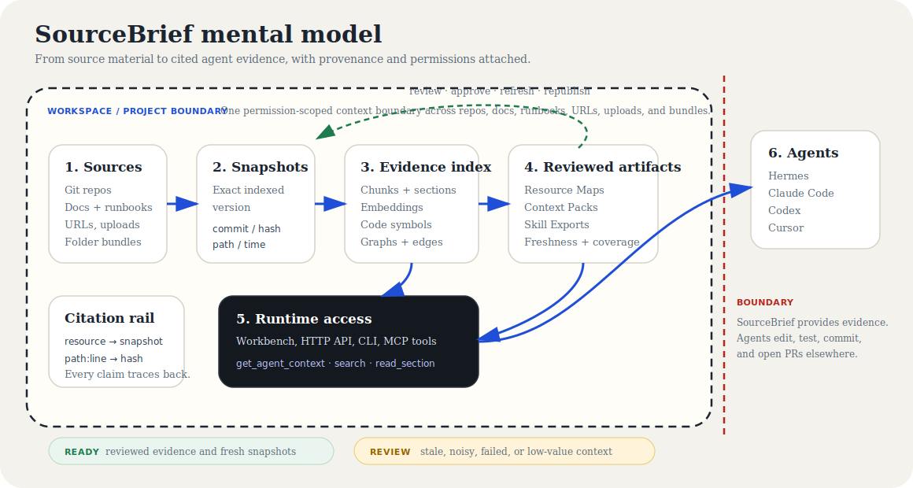
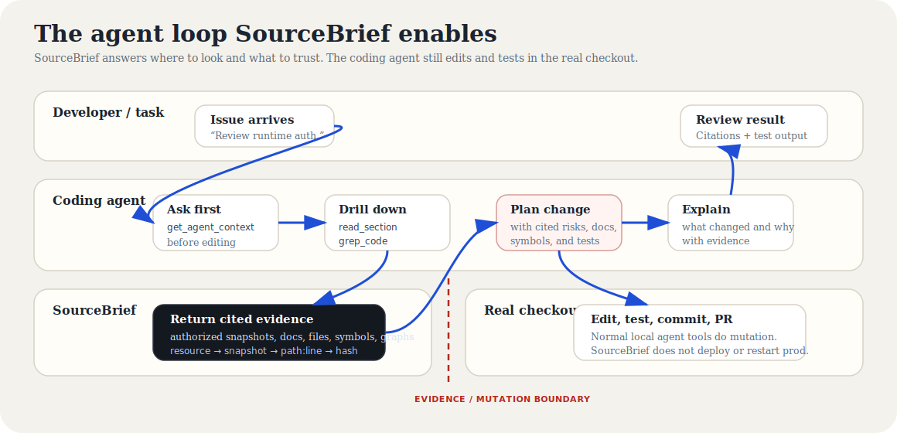
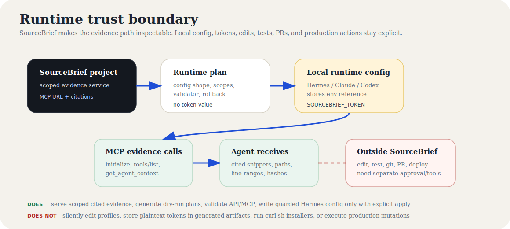

# SourceBrief

> Cited project context for coding agents.

Coding agents do not need bigger prompts. They need evidence they can inspect before they edit.

SourceBrief turns repos, docs, runbooks, URLs, uploads, and folder bundles into versioned context that Hermes, Claude Code, Codex, Cursor, and other MCP-compatible agents can query on demand. A good SourceBrief answer is not just plausible; it points back to source material with citations, snapshots, paths, line ranges, hashes, and follow-up read handles.

Use it when you need agents to answer with evidence, not vibes.

[See the walkthrough](docs/WALKTHROUGH.md) · [Run it locally](docs/QUICKSTART.md) · [Try the 5-minute demo](docs/DEMO.md) · [View examples](examples/awesome-agent-harness-50q/README.md) · [Use it with agents](docs/AGENT_RUNTIME_USAGE.md) · [Contribute](CONTRIBUTING.md)



## The problem

AI coding agents are becoming daily engineering tools, but the context layer is still handled like a hack:

- developers paste random files into prompts
- repo-local instruction files drift from reality
- runbooks, architecture notes, and source code live in different places
- generated answers often cannot prove which commit, file, line, or document version they came from
- every repo wants its own MCP server, prompt bundle, or ad hoc retrieval script
- teams have no review loop for stale, noisy, or low-value context

SourceBrief exists so agents can ask the project for cited, permission-scoped evidence before they act.

## See it work


This walkthrough was captured from a real local SourceBrief stack with live API, workers, Postgres, Redis, two indexed resources, and a real `agent-context` response. See the full [product walkthrough](docs/WALKTHROUGH.md) and the captured [agent-context output](docs/examples/agent-context-output.md).

A useful SourceBrief answer looks like this:

```text
Question: How does this project expose context to agents?

Answer:
SourceBrief exposes agent context through the project-scoped agent-context API
and the central MCP endpoint.

Evidence:
- apps/api/sourcebrief_api/main.py
  agent-context response shape and route
- apps/api/sourcebrief_api/main.py
  MCP tools/list and tools/call dispatch
- docs/ARCHITECTURE.md
  agent context and MCP runtime paths

The response includes runtime instructions, cited snippets, structured citations,
optional code symbols, and a token budget hint.
```

That is the product bar: an agent can act on the answer because every claim points back to source.

## How SourceBrief works

```text
connect sources
    -> index versioned snapshots
    -> build chunks, embeddings, code symbols, and graphs
    -> review freshness, coverage, and low-value context
    -> publish pinned Context Packs when a workflow needs reviewed evidence
    -> serve cited evidence through Workbench, HTTP, CLI, or MCP
```

| Layer | What it means |
| --- | --- |
| Sources | Git repos, Markdown/runbooks, URLs, uploads, and zip folder bundles. |
| Snapshots | Exact indexed versions with commit, content hash, path, and timestamp provenance. |
| Evidence index | Chunks, retained sections, embeddings, code symbols, graph nodes/edges, and citation locators. |
| Review artifacts | Resource Maps, freshness, coverage, Context Packs, and Skill Exports for repeatable workflows. |
| Runtime access | Workbench, HTTP API, CLI, and project-scoped MCP tools for agents. |

A SourceBrief project is a context boundary for a product, service, or repo group. Put multiple repos, runbooks, architecture notes, URLs, uploads, and zip/folder bundles into one project, then let agents ask one authorized endpoint for evidence across the resources they are allowed to see.

## The agent workflow



SourceBrief changes the agent loop:

```text
coding agent gets an issue
    -> asks SourceBrief MCP for relevant docs, files, symbols, and risks
    -> reads exact cited sections from indexed snapshots
    -> edits and tests in the real checkout
    -> explains the change with citations instead of vibes
```

Start broad with `sourcebrief.ask` or `sourcebrief.discover`. Use `sourcebrief.lookup` for docs/code/symbol discovery. Drill down with `sourcebrief.search`, `sourcebrief.read_section`, `sourcebrief.search_code`, `sourcebrief.grep_code`, `sourcebrief.read_file`, `sourcebrief.find_symbol`, and graph tools when the task needs exact evidence. Use SourceBrief to know where to look and what to trust; use the coding agent's normal tools to edit, test, commit, and open PRs.

For runtime setup, prompts, token scopes, remote-code safety, generated skills, and exact MCP tool guidance, read [Agent runtime usage](docs/AGENT_RUNTIME_USAGE.md).

## Before and after SourceBrief

| Task | Without SourceBrief | With SourceBrief |
| --- | --- | --- |
| Review a runtime-auth change | The agent searches whatever files are local, guesses which token path matters, and may miss docs or tests in sibling folders. | The agent asks SourceBrief for service-token evidence, gets cited API routes, CLI commands, MCP auth docs, and tests, then edits the real checkout with a source-backed plan. |
| Onboard to an unfamiliar repo group | The agent reads a README and a few files that fit in context, then invents a mental model. | The agent asks for architecture evidence across repos, docs, runbooks, symbols, and graph paths, then follows citations into exact sections before summarizing. |
| Triage a stale runbook | The agent repeats old instructions because they were pasted into the prompt. | SourceBrief reports the indexed snapshot, freshness/review state, and cited sections, so the agent can say what is current, stale, or missing. |

## Choose your path

| I want to... | Start here |
| --- | --- |
| See the product before installing | [Product walkthrough](docs/WALKTHROUGH.md) |
| Try a deterministic 5-minute demo | [5-minute demo](docs/DEMO.md) |
| Run the full local stack | [Quick start](docs/QUICKSTART.md) |
| Connect Hermes, Claude Code, Codex, Cursor, or another MCP client | [Agent runtime usage](docs/AGENT_RUNTIME_USAGE.md) |
| Generate a guarded runtime config plan | [Runtime install plan](docs/RUNTIME_INSTALL_PLAN.md) |
| Learn the vocabulary | [Concepts](docs/CONCEPTS.md) |
| Understand the system design | [Architecture](docs/ARCHITECTURE.md) |
| Operate or debug the local stack | [Operations](docs/OPERATIONS.md) |
| Check alpha readiness and limits | [Project status](docs/STATUS.md) |
| Review real evaluation examples | [Awesome Agent Harness 50-question example](examples/awesome-agent-harness-50q/README.md) |
| Use SourceBrief with a local agent | [Local-agent runtime example](examples/use-sourcebrief-with-local-agent/README.md) |

## Trust boundaries



| Boundary | SourceBrief does | SourceBrief does not |
| --- | --- | --- |
| Project/resource access | Enforces workspace, project, resource, and token scopes. | Widen token-scoped access silently. |
| Runtime install | Generates inspectable plans, config snippets, validator commands, and rollback steps. | Silently edit Hermes, Claude, Codex, Cursor, shell profiles, or local runtime files. |
| Tokens | Uses placeholders or runtime-native environment references. | Put plaintext bearer tokens in generated plans, config snippets, or receipts. |
| Remote code | Serves indexed evidence with citations and exact-read handles. | Pretend indexed code is the editable local checkout. |
| Mutation | Can produce guarded proposals when explicitly enabled. | Deploy, restart services, mutate production, or open PRs without separate approval/tooling. |

SourceBrief is a local alpha for development and product exploration. It is not a public-internet-hardened SaaS distribution yet. See [project status](docs/STATUS.md) for shipped, experimental, and future work.

## Run it locally

This starts the real local stack and opens the web console.

### Prerequisites

- Docker with Compose
- Python 3.11
- [uv](https://docs.astral.sh/uv/)
- Node.js 20+
- npm
- git

On a clean Linux host, install `uv` with `curl -LsSf https://astral.sh/uv/install.sh | sh`, add `$HOME/.local/bin` to `PATH`, and run `uv python install 3.11` if Python 3.11 is not already available. The project venv uses `uv venv --python 3.11`; the host `python3` may be newer.

### Start the stack

```bash
git clone https://github.com/pingchesu/sourcebrief.git
cd sourcebrief

cp .env.example .env
# Edit SOURCEBRIEF_ADMIN_PASSWORD before the first startup.
# SourceBrief has no universal `changeme` login; see docs/DEFAULT_CREDENTIAL_POLICY.md.
# Keep SOURCEBRIEF_DEV_AUTH=false unless you explicitly want local header auth for CLI experiments.

python3 scripts/check_quickstart_prereqs.py

make compose-up
make quickstart-ready
```

If you will open the web console from another machine, set `NEXT_PUBLIC_API_BASE_URL` to the browser-visible API URL and add the web origin to `SOURCEBRIEF_CORS_ORIGINS` before `make compose-up`; changing the API base later requires `docker compose up -d --build`. The [Quick start](docs/QUICKSTART.md#remote-browser--self-host-setup) includes the exact remote/self-host snippet.

Open the web console:

```bash
printf '%s/login\n' "$(make -s print-web-url)"
```

Sign in with the admin email and password from `.env`:

```text
SOURCEBRIEF_ADMIN_EMAIL
SOURCEBRIEF_ADMIN_PASSWORD
```

From the UI, connect a source, inspect its indexing lifecycle, ask in Workbench, and review citations before using the context from an agent runtime. The full [Quick start](docs/QUICKSTART.md) includes CLI experiments, verification commands, and troubleshooting.

## Architecture, briefly

SourceBrief uses boring infrastructure on purpose:

```text
Web UI / CLI / Agent client
        -> FastAPI API + MCP routes
        -> PostgreSQL + pgvector
        -> Redis/RQ workers
        -> source snapshots, chunks, symbols, graphs, context packs, skill exports
```

Read the full design in [Architecture](docs/ARCHITECTURE.md).

## Contributing

Contributions are welcome. Please start with a GitHub issue for bugs, feature proposals, or evaluation/example requests so scope and acceptance criteria are visible before implementation. See [CONTRIBUTING.md](CONTRIBUTING.md) and the issue templates in `.github/ISSUE_TEMPLATE/`.

## Development

Useful commands:

```bash
make help       # list common commands
make compose-up # start local services
make verify     # full local acceptance gate
```

`make verify` runs lint, typecheck, unit tests, real-service integration tests, Docker Compose startup, migrations, QA smoke, and alpha eval. It is intentionally heavier than the quick start.

## Security and privacy

SourceBrief analyzes only the sources you connect or upload. Use built-in skip rules, bounded import settings, and redaction checks to reduce accidental indexing of secrets, vendored code, generated files, or private material.

Generated Skill Packs and runtime adapters should point agents back to SourceBrief citations. They should not embed an entire private source corpus.

## License

MIT
