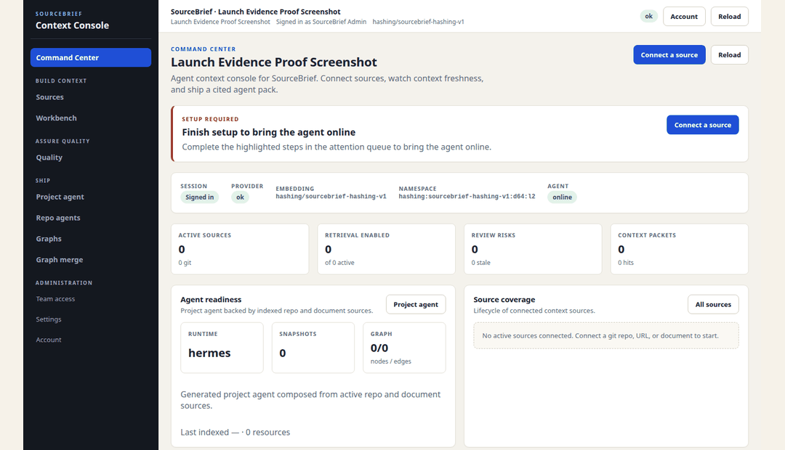
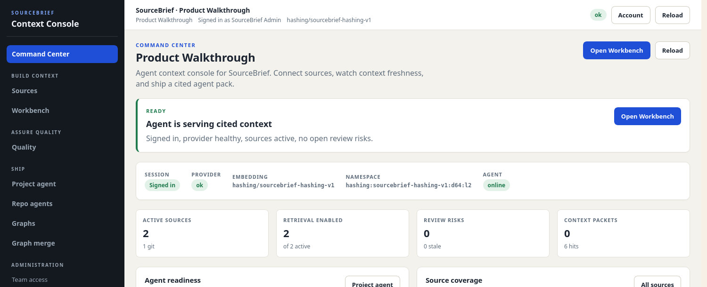
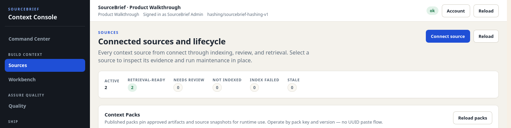
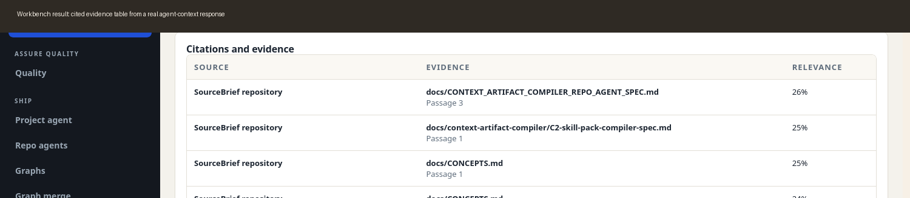

# Product walkthrough

This walkthrough uses artifacts captured from a real local SourceBrief stack. The run used the live API, Postgres, Redis, workers, web UI, a Markdown docs resource, and a Git resource for the SourceBrief repository.

The goal is simple: show what a new user should see before they decide whether SourceBrief is worth trying.

## The flow

1. Start in Command Center to see workspace/project readiness.
2. Open Sources to inspect connected sources, indexing state, freshness, and review status.
3. Ask in Workbench and inspect the cited context packet before handing it to an agent runtime.

## Screenshots

### Command Center

The Command Center is the product entry point. It should answer: is this project ready for an agent to use?

### Sources lifecycle

Sources is where a user connects repos, docs, URLs, uploads, and folder bundles. The screenshot below was captured after a real docs resource and a real Git resource both indexed successfully.

### Workbench citations

Workbench shows the exact context packet a runtime agent would receive. A useful answer should expose citations and evidence, not just plausible prose.

## Example runtime output

The same run produced a real `agent-context` response with six citations:

- [Example agent-context output](examples/agent-context-output.md)

Internal IDs and token values are normalized or omitted in the rendered example. The committed output still comes from the live local API and indexed resources.

## Capture evidence

Captured from branch `docs/product-walkthrough-assets` against local SourceBrief services:

- API: live `/readyz`
- Web: live `/api/health`
- Resources indexed successfully:
  - `SourceBrief docs walkthrough excerpt`
  - `SourceBrief repository`
- Agent-context query: `How does SourceBrief expose evidence-backed context to coding agents?`
- Citations returned: 6

These are documentation assets, not golden product tests. The release gate and smoke tests still live in the Makefile and CI path.
