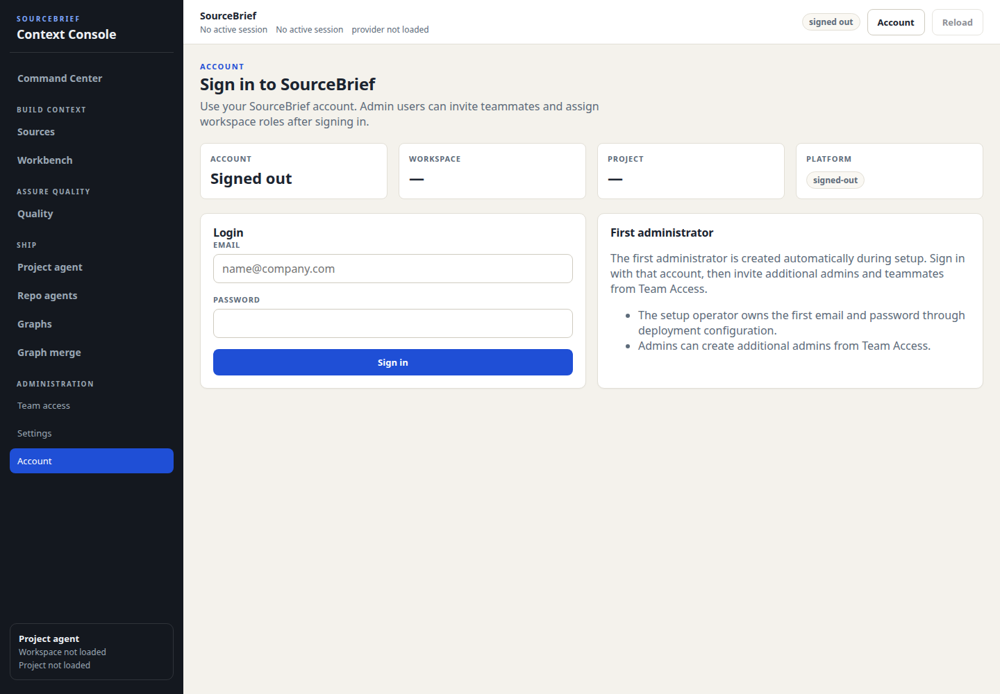
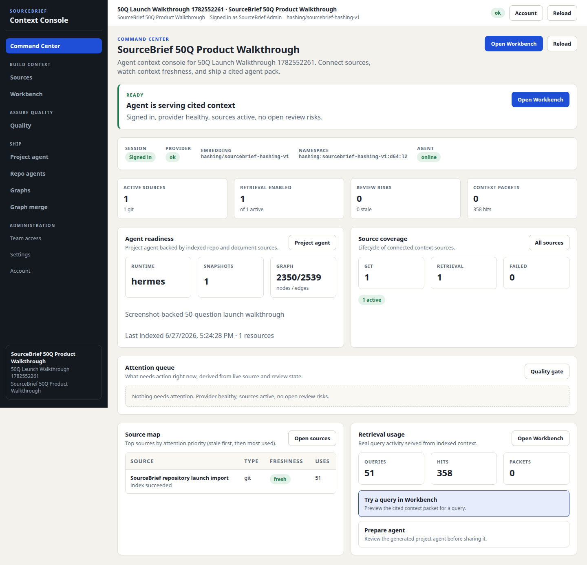
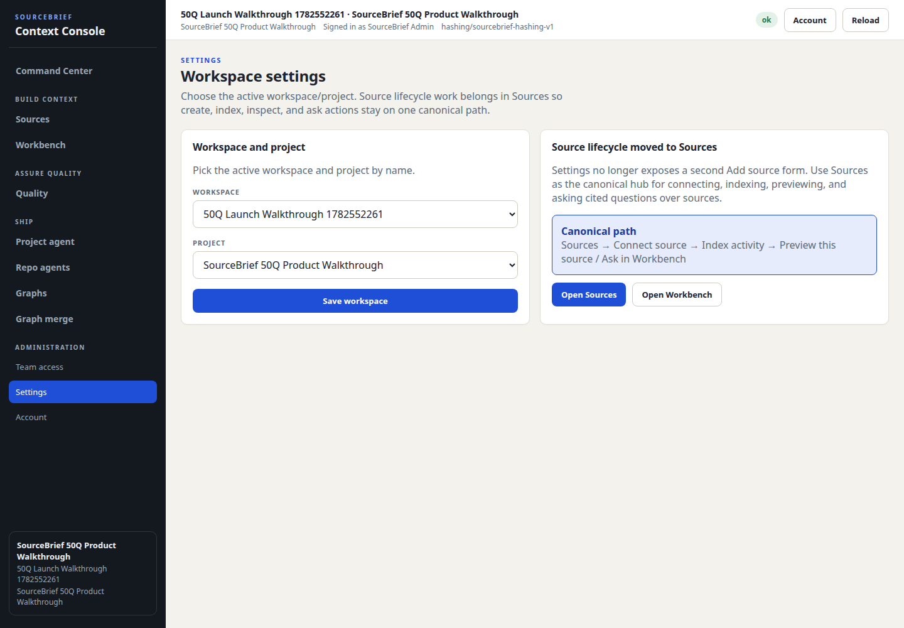
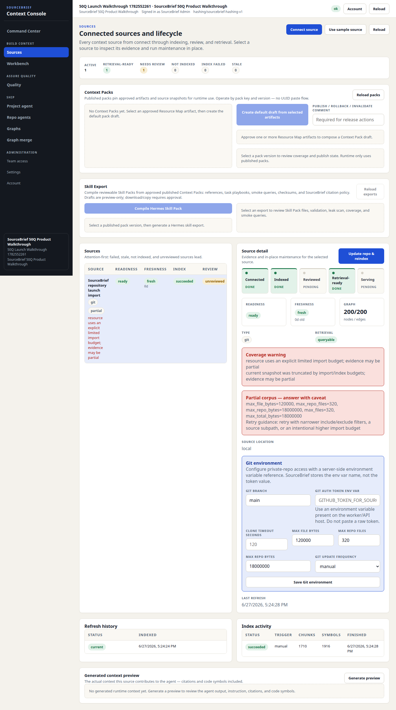
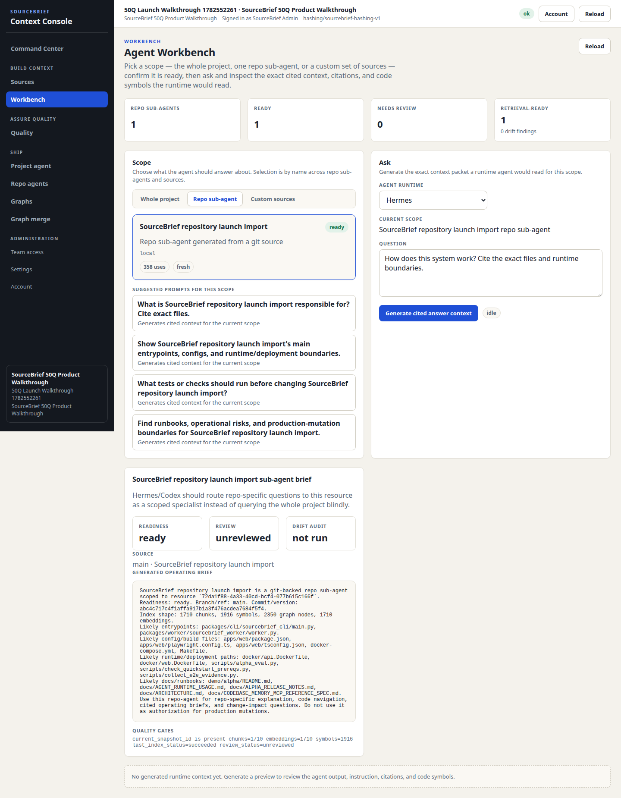
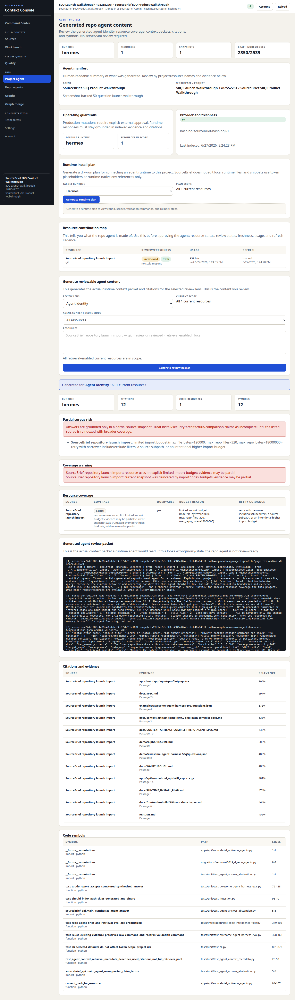
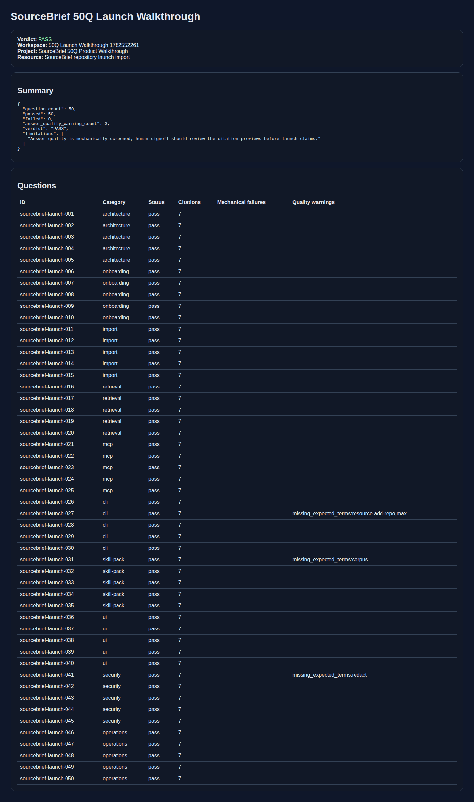

# SourceBrief screenshot-backed 50Q launch walkthrough

Issue: [#141](https://github.com/pingchesu/sourcebrief/issues/141)
Run date: 2026-06-27
Commit under test: `abc4c717c4f1affa917b1a3f476acdea7684f5f4`

## Verdict

`PASS` for mechanical launch walkthrough evidence, with 3 answer-quality follow-ups opened.

| Check | Result |
| --- | --- |
| Local services | API `/readyz` and web `/api/health` reachable |
| Auth path | Session login; no raw token-first UI path |
| Workspace/project UX | Human-readable names: `50Q Launch Walkthrough …` / `SourceBrief 50Q Product Walkthrough` |
| Import | Bounded real SourceBrief repository git bundle import succeeded |
| Indexed evidence | 240 documents, 1,710 chunks, 1,916 symbols, 1,710 embeddings, 2,350 graph nodes |
| 50Q mechanical run | 50/50 passed with citations |
| Scenario coverage | MCP context, bounded grep drilldown, and CLI fallback search passed |
| Screenshots | 7 sanitized screenshots committed below |

## Screenshots

1. Login screen

   

2. Command Center / dashboard

   

3. Workspace/project selection by name

   

4. Source import lifecycle and partial corpus warning

   

5. Workbench / citation surface

   

6. Agent profile / runtime configuration surface

   

7. 50Q report summary

   

## Runnable command

From a local SourceBrief checkout with compose services available:

```bash
source .venv/bin/activate
python scripts/launch_50q_walkthrough.py \
  --skip-compose \
  --question-limit 50 \
  --artifact-dir artifacts/sourcebrief-launch-50q-run
```

To include service startup in the same command, omit `--skip-compose`:

```bash
python scripts/launch_50q_walkthrough.py \
  --question-limit 50 \
  --artifact-dir artifacts/sourcebrief-launch-50q-run
```

Generated artifacts stay under ignored `artifacts/` by default. Only sanitized screenshots and this report are committed.

## 50Q result

The runner separates **mechanical pass/fail** from **answer-quality warnings**.

- Mechanical failures: `0`
- Mechanical passes: `50`
- Answer-quality warnings: `3`

Follow-up issues opened:

- [#145](https://github.com/pingchesu/sourcebrief/issues/145) — `sourcebrief-launch-027`, CLI bounded import terms.
- [#146](https://github.com/pingchesu/sourcebrief/issues/146) — `sourcebrief-launch-031`, skill-pack excluded corpus terminology.
- [#147](https://github.com/pingchesu/sourcebrief/issues/147) — `sourcebrief-launch-041`, token redaction terminology.

## Notes and limitations

- The imported repository is a bounded git bundle of the real SourceBrief repository so the proof is reproducible and does not depend on public network GitHub availability.
- The import is intentionally marked partial because the runner uses bounded launch-proof budgets (`max_repo_files`, `max_file_bytes`, `max_repo_bytes`). Partial coverage is surfaced in the UI screenshot and report instead of hidden.
- Answer-quality warnings are not treated as mechanical retrieval failures. They remain follow-up issues because launch-facing language still matters.
- The generated report redacts tokens, UUIDs, and password-like fields. Public screenshots were inspected for tokens, raw UUIDs, private local paths, and secrets before commit.
